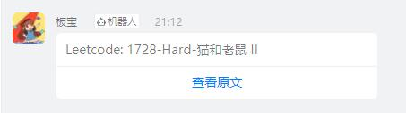

# Leetcode每日一题钉钉推送

## 推送模块:

结合使用推送模块, 修改`pusher.py`内的配置内容，可以实现如下推送
- ★钉钉群机器人
  - DING_ACCESS_TOKEN、DING_SECRET
- pushplus
  - PUSHPLUS_TOKEN
- serverchan
  - SERVERCHAN_TOKEN

注：需要设置环境变量(如果是GithubAction中使用的话，则是设置secrets)or修改pusher中的配置代码.

## 更新日志:

- 2022年5月10日: 丰富推送模块, 并提供GithubAction secrets修改
  在仓库的secrets中设置
    - PUSHPLUS_TOKEN
    - SERVERCHAN_TOKEN
    - DING_ACCESS_TOKEN、DING_SECRET
- 2022年3月1日: 编写脚本

推荐使用钉钉群机器人，效果如下:
